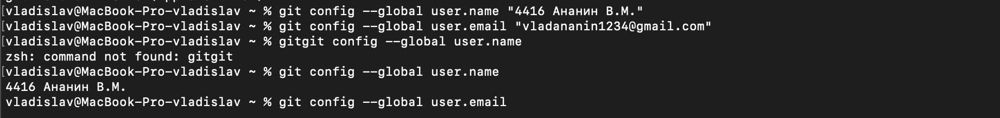

# Лабораторная работа №6
## Система контроля версий

Цель лабораторной работы: изучение базовых возможностей системы управления версиями, опыт работы с Git Api, опыт работы с локальным и удаленным репозиторием.

### Ход работы 

#### 1. Настроен клиент Git.
```
git config --global user.name "4416 Ананин В.М."
git config --global user.email "vladananin1234@gmail.com" 
```


#### 2. Клонирован личный репозиторий на компьютер
```
git clone <https://github.com/Fbsusb/LR6.git>
```


#### 3. Добавлен файл через интерфейс GitHub. Подтянуты изменения в локальный репозиторий.
```
git pull
```


