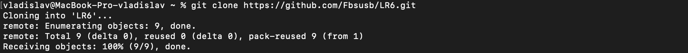
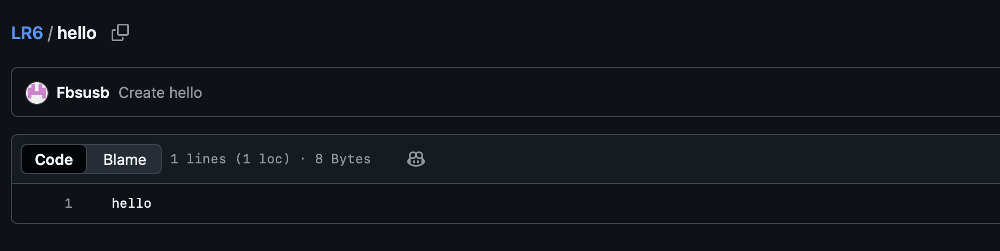
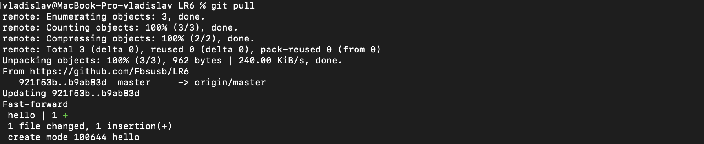
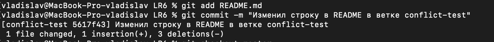
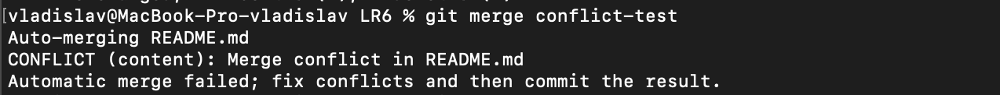
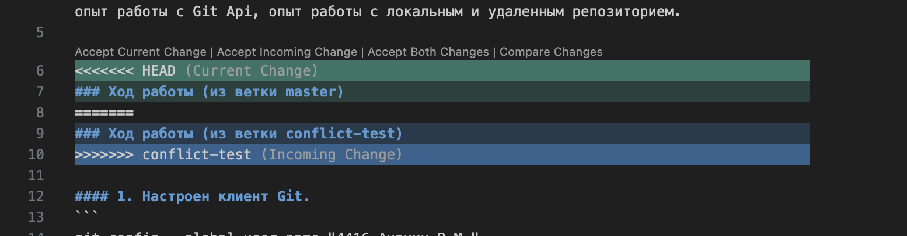
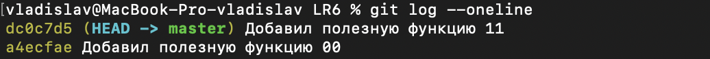
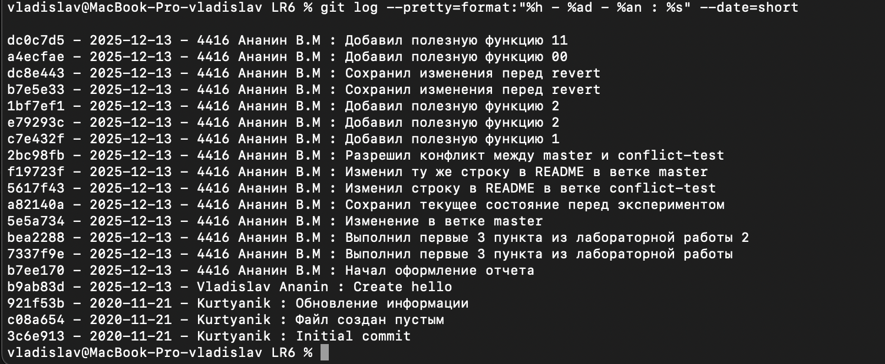
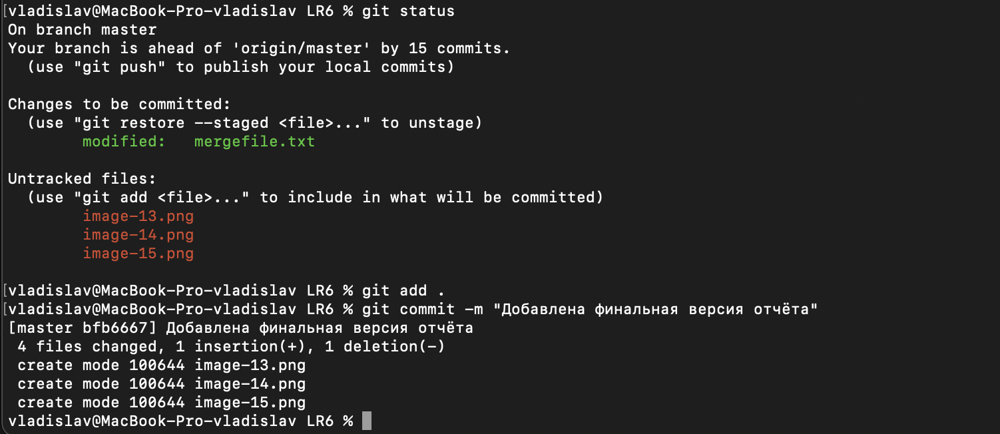

# Лабораторная работа №6
## Система контроля версий

Цель лабораторной работы: изучение базовых возможностей системы управления версиями, опыт работы с Git Api, опыт работы с локальным и удаленным репозиторием.

### Ход работы

#### 1. Настроен клиент Git.
```
git config --global user.name "4416 Ананин В.М."
git config --global user.email "vladananin1234@gmail.com" 
```


#### 2. Клонирован личный репозиторий на компьютер
```
git clone <https://github.com/Fbsusb/LR6.git>
```


#### 3. Добавлен файл через интерфейс GitHub. Подтянуты изменения в локальный репозиторий.
```
git pull
```



#### 4. Создана ветка conflict-test
```
git checkout -b conflict-test
```


#### 5. Внесение изменений в файле README.md ветки conflict-test.
```
git add README.md
git commit -m "Изменил строку в README в ветке conflict-test"
```


#### 6. Внесение изменений в файле README.md ветки master
```
git checkout master
git add README.md
git commit -m "Изменил ту же строку в README в ветке master"
```


#### 7. Попытка слияния веток.
```
git merge conflict-test
```



#### 8. Разрешение конфликта 
```
git add README.md
git commit -m "Разрешил конфликт между master и conflict-test"
```


#### 9. Удаление ветки 
```
git branch -d conflict-test 
```


#### 10. Откаты и отчет
Фиксация изменений в файле mergefile.txt
```
git add .
git commit -m "Добавил полезную функцию 1"
git commit -m "Добавил полезную функцию 2" 
```


Откат второго коммита 
```
git log --oneline
git revert git revert a4ecfae
```


#### 11. Получена история операций в форматированном виде.
```
git log --pretty=format:"%h - %ad - %an : %s" --date=short
```


#### 12. Финальная версия отчета.
```
git status
git add .
git commit -m "Добавлена финальная версия отчёта"
```


Выводы: изучены базовые возможности системы управления версиями, получен опыт работы с Git Api, получен опыт работы с локальным и удаленным репозиторием.
